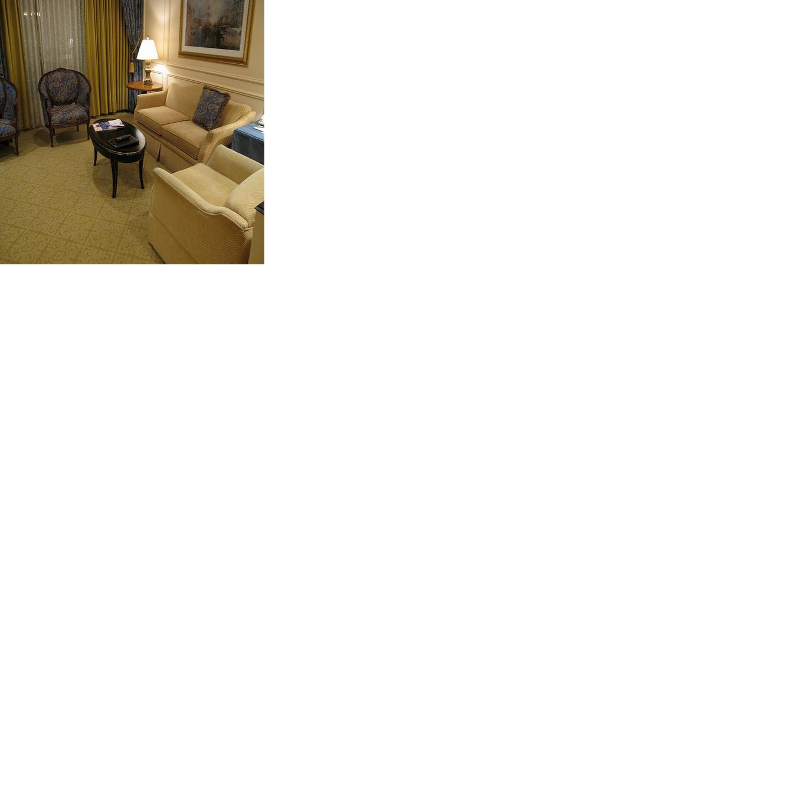
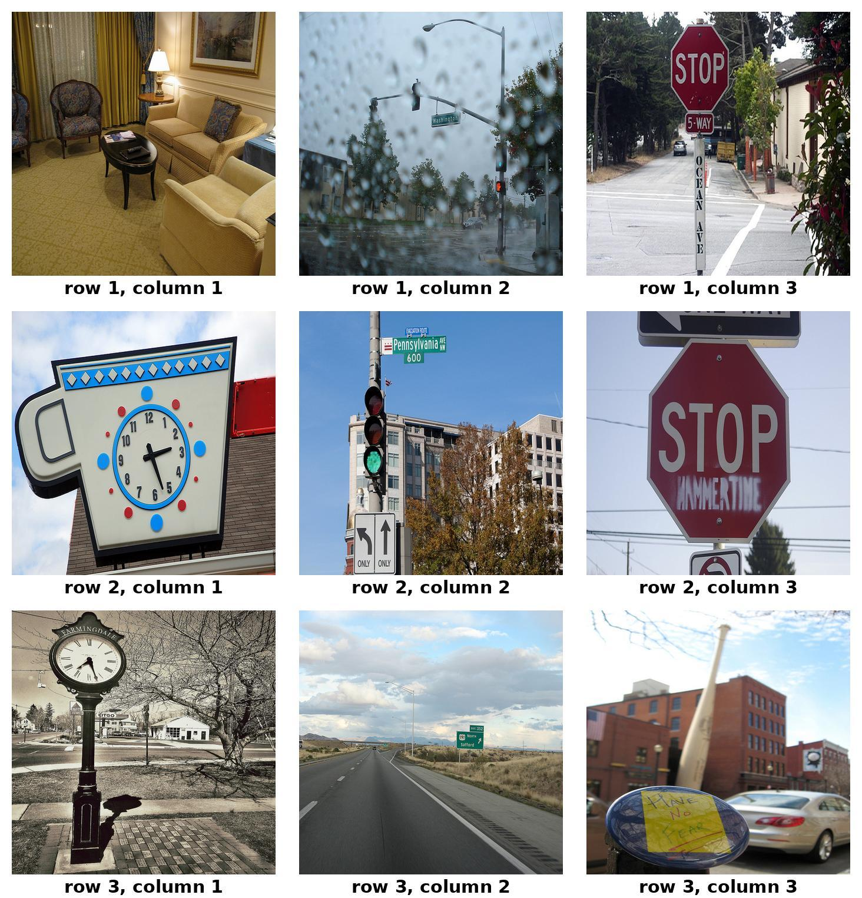
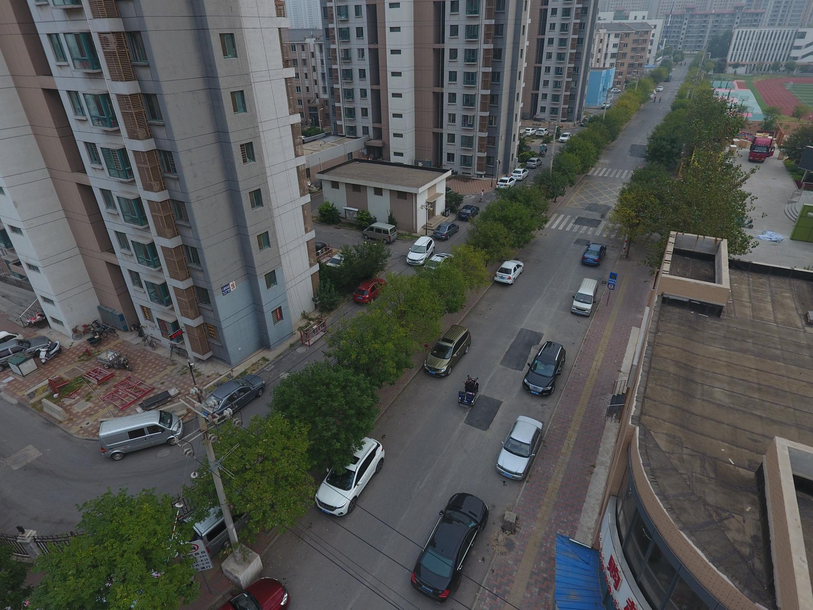

# <div align="center"><h5> HRScene - High Resolution Image Understanding</h5></div>

## ⭐ About HRScene

<p>We introduce <strong>HRScene</strong>, a novel unified benchmark for HRI understanding with rich scenes. LogoHRScene incorporates 25 real-world datasets and 2 synthetic diagnostic datasets with resolutions ranging from <strong>1,024 × 1,024 to 35,503 × 26,627</strong>. HRScene is collected and re-annotated by 10 graduate-level annotators, covering <strong>25 scenarios</strong>, ranging from microscopic and radiology images to street views, long-range pictures, and telescope images. It includes high-resolution images of real-world objects, scanned documents, and composite multi-image.</p>

<p> Some examples of LogoHRScene. Blue ones are diagnostic datasets, and purple ones are real-world datasets. In this challenge, we only focus on the submission of real-world examples.</p>

<p>HRScene consists of 7,073 samples, divided into three splits:</p>
val contains 750 samples. These samples are identical to human-annotated ones, designed for fine-grained validation of the users' VLM settings. |
testmini comprises 1,000 samples, picked from each LogoHRScene real-world dataset, intended for rapid model development evaluation or for those with limited computing resources. | 
test features the remaining 5,323 samples for standard evaluation. Notably, the answer labels for test will not be publicly released to facilitate fair evaluation. Instead, we maintain an online evaluation platform for user submissions. |


## 🏆 Leaderboard 🏆

我白天叫gpt做ocr把这些填了，手动填太慢了

### Leaderboard on the WhiteBackground Task

| **#** | **Model** | **1x1** | **3x3** | **5x5** |**7x7** | **10x10** |
| ----- | ------------------------------------ | ---------- | ------------------------------------------------------------ | ---------- | -------- | ------- |
| -     | **Human Performance\***              | -          | [Link](https://arxiv.org/abs/2310.02255)                     | 2023-10-03 | **60.3** | 59.7    | 48.4    | 73.0    | 63.2    | 55.9    | 50.9    | 59.2    | 51.4    | 40.7    | 53.8    | 64.9    | 63.9    |
| 1     | **OpenAI o1 🥇**                      | LMM 🖼️      | [Link](https://openai.com/index/learning-to-reason-with-llms/) | 2024-09-12 | **73.9** | -       | -       | -       | -       | -       | -       | -       | -       | -       | -       | -       | -       |

### Leaderboard on the ComplexGrid Task

| **#** | **Model** | **3x3** | **5x5** |**7x7** | **10x10** |
| ----- | ------------------------------------ | ------------------------------------------------------------ | ---------- | -------- | ------- |
| -     | **Human Performance\***              | -          | [Link](https://arxiv.org/abs/2310.02255)                     | 2023-10-03 | **60.3** | 59.7    | 48.4    | 73.0    | 63.2    | 55.9    | 50.9    | 59.2    | 51.4    | 40.7    | 53.8    | 64.9    | 63.9    |
| 1     | **OpenAI o1 🥇**                      | LMM 🖼️      | [Link](https://openai.com/index/learning-to-reason-with-llms/) | 2024-09-12 | **73.9** | -       | -       | -       | -       | -       | -       | -       | -       | -       | -       | -       | -       |

### Leaderboard on the RealWorld Task

| **#** | **Model** | **Art** | **Daily** | **Medical** | **Paper** | **Remote** | **Research** | **Sub-Img** | **Urban** | **Average** |
| ----- | --------- | ------- | --------- | ----------- | --------- | ---------- | ------------ | ----------- | --------- | ----------- |
| 1 | **Qwen2-72B-Instruct** | 72.7 | 64.3 | 45.9 | 76.5 | 54.9 | 46.8 | 79.3 | 46.2 | **62.2** |
| 2 | **gemini-2-flash** | 74.3 | 59.4 | 57.1 | 75.3 | 56.1 | 41.9 | 73.2 | 40.2 | **60.3** |
| 3 | **InternVL2-40B** | 70.2 | 62.8 | 35.4 | 67.6 | 50.3 | 51.4 | 77.2 | 41.0 | **58.1** |
| 4 | **Qwen2-VL-7B-Instruct** | 71.0 | 61.4 | 48.5 | 62.9 | 55.6 | 46.0 | 79.5 | 34.4 | **57.7** |
| 5 | **Llava-OneVision-72B** | 65.1 | 64.3 | 49.8 | 65.0 | 48.0 | 55.6 | 63.7 | 41.1 | **56.9** |


## 📊 Dataset Examples

Examples of our newly annotated datasets: **WhiteBackground**, **ComplexGrid**, and **RealWorld**:

### WhiteBackground

question: "Is it daytime?"

answer: "[ "no", "no", "no", "no", "no", "no", "no", "no", "no", "no" ]"

<p align="center">
     <br>
</p>

### ComplexGrid

caption: "A nice living room has chairs and a love seat."

answer: "row: 1, col: 1"

<p align="center">
     <br>
</p>

### RealWorld

question: "Where is the awning-tricycle in the image? \n(A) The upper left corner \n(B) The upper right corner \n(C) The lower left corner \n(D) The lower right corner \n(E) The image does not feature the awning-tricycle"

answer: "B"

<p align="center">
     <br>
</p>

## 📖 Dataset Usage

### Data Downloading

By using our pipeline, you dont need to download the dataset manually.

For whitebackground and complexgrid, you only need to set the `dataset_name` for the tester like we did in the [Diagnosis/example.py](Diagnosis/example.py).

```python
tester = DiagnosisTester(model=model, dataset_name="complexgrid_3x3", num_samples=150)
```

For realworld, you need to set the `dataset_name` and `split` for the tester like we did in the [RealWorld/example.py](RealWorld/example.py).

```python
tester = RealWorldTester(model=model, dataset_name="realworld_combined", split="test")
```

Or you wanna download the dataset manually, you can use the following code:

```python
from datasets import load_dataset


# for whitebackground and complexgrid, we only have 'test' split
dataset = load_dataset("Wenliang04/HRScene", "whitebackground_1x1")
for sample in dataset['test']:
    print(sample)

# for realworld, we have 'testmini', 'validation', 'test' splits
dataset = load_dataset("Wenliang04/HRScene", "realworld_combined")
for sample in dataset['test']:
    print(sample)
```

### Data Format

#### WhiteBackground

id: int, 
image: PIL.JpegImagePlugin.JpegImageFile, 
question: str, 
answer: list[str]

```bash
{'image': <PIL.JpegImagePlugin.JpegImageFile image mode=RGB size=448x448 at 0x7F01D88BF7A0>, 'id': 0, 'question': 'Is it daytime?', 'answer': ['no', 'no', 'no', 'no', 'no', 'no', 'no', 'no', 'no', 'no']}
```

#### ComplexGrid

id: str, 
image: PIL.JpegImagePlugin.JpegImageFile, 
caption: str, 
answer: str

```bash
{'image': <PIL.JpegImagePlugin.JpegImageFile image mode=RGB size=1464x1524 at 0x7FB8634E6B70>, 'id': '0_0_0', 'caption': 'A nice living room has chairs and a love seat.', 'answer': 'row: 1, col: 1'}
```

#### RealWorld

id: int, 
image: PIL.Image.Image, 
question: str, 
answer: str

```bash
{'id': 0, 'image': <PIL.JpegImagePlugin.JpegImageFile image mode=RGB size=5760x1200 at 0x7F4994CB75F0>, 'question': 'What is motion of the pedestrian wearing blue top on the left?\n(A) crossing the crosswalk\n(B) standing\n(C) jaywalking (illegally crossing not at pedestrian crossing)\n(D) walking on the sidewalk\n(E) The image does not feature the object', 'answer': 'None'}
```

## 🔮 Evaluations on HRScene

Submit your results to [EvalAI](https://eval.ai/web/challenges/challenge-page/2501/submission) and get your score on the leaderboard.

If you were using our pipeline to run `realworld_combined` for `test` split, it will generate a `submission.json` file for you, file save path will be printed on the terminal.

example python pipeline:

```python
from models import GPT
from tester import RealWorldTester

model = GPT(model_path="gpt-4o-mini")
tester = RealWorldTester(model=model, dataset_name="realworld_combined", split="test")
tester.run(max_tokens=100)
tester.eval()
```

example terminal output:

```bash
Finished parsing, results saved in: results/realworld/20250406_203208. Ready for submission.
```

## 📜 License

<a rel="license" href="http://creativecommons.org/licenses/by-nc-sa/4.0/"></a><br /><span xmlns:dct="http://purl.org/dc/terms/" property="dct:title"><a rel="license" href="http://creativecommons.org/licenses/by-nc-sa/4.0/">Creative Commons Attribution-NonCommercial-ShareAlike 4.0 International License</a>.

## :white_check_mark: Cite

TODO: 等paper挂arxiv我加
